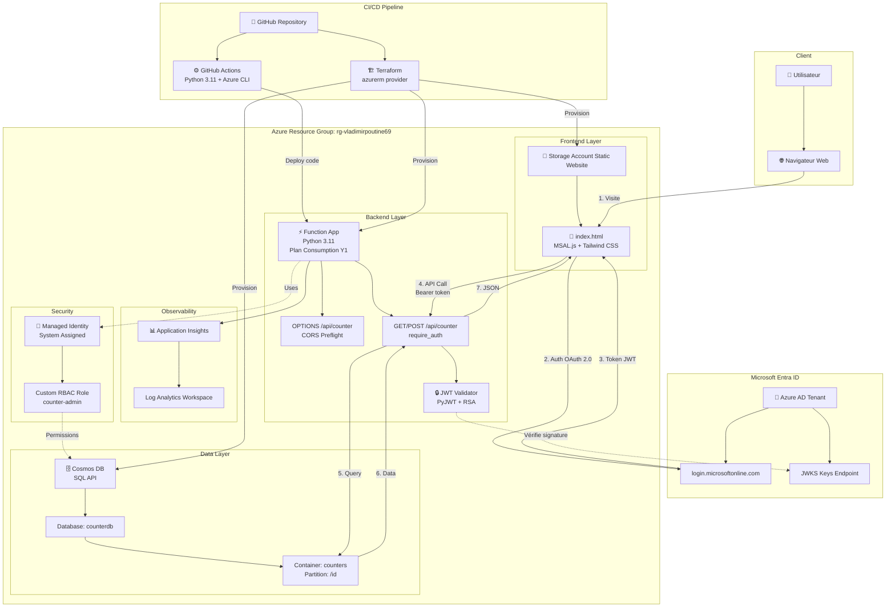
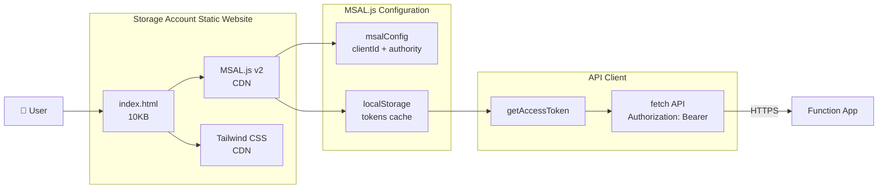
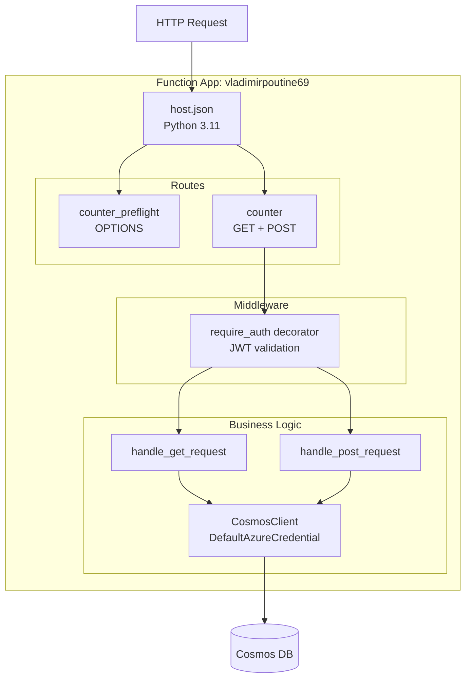
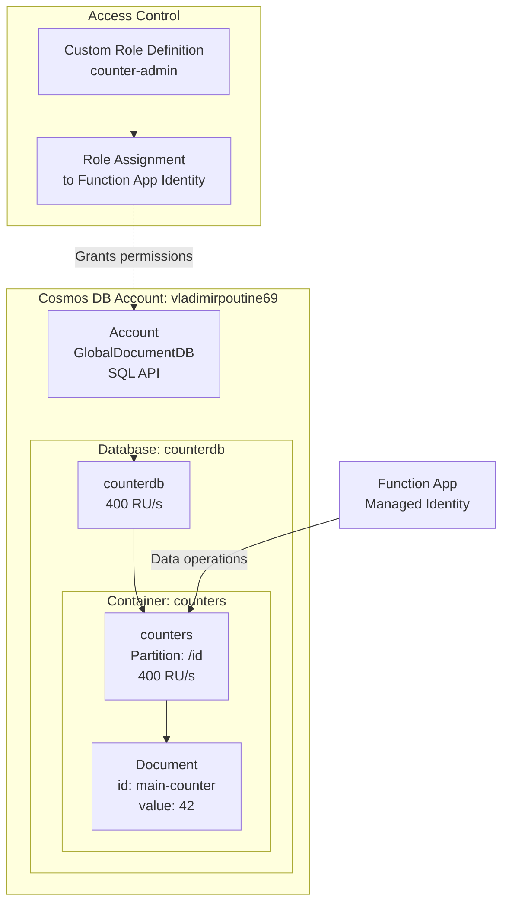
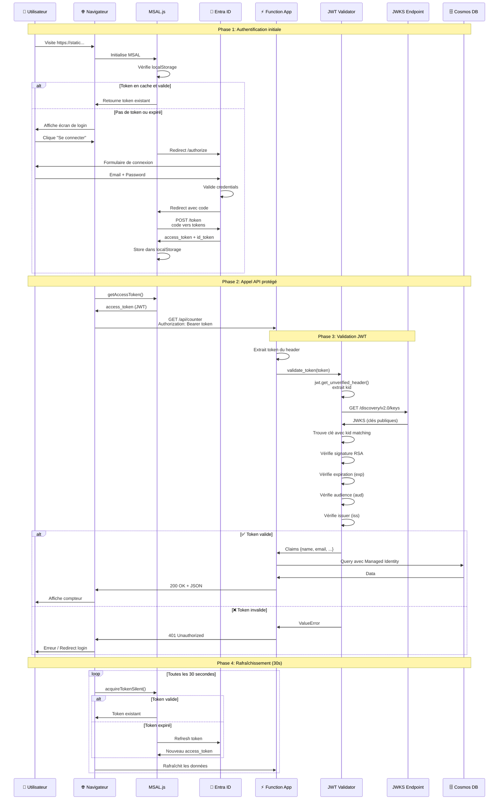
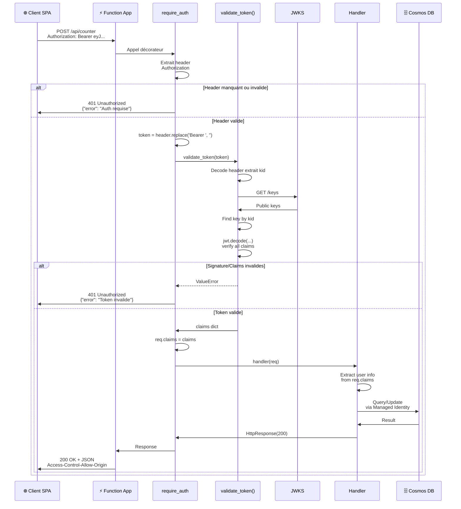
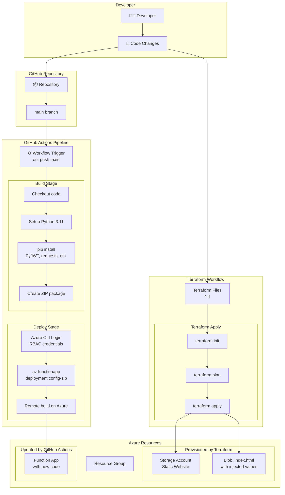
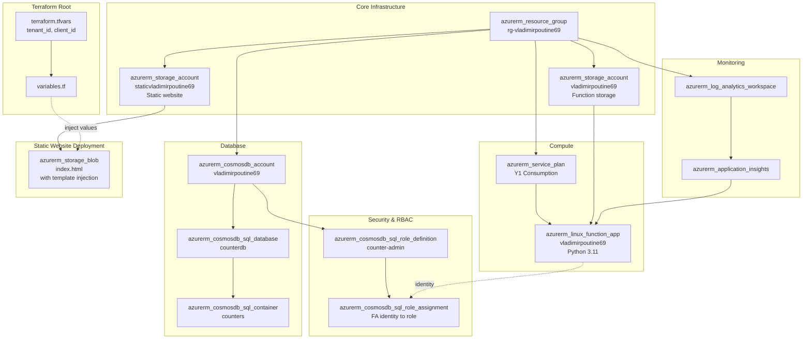

# Architecture - Azure Functions avec MSAL.js

Documentation visuelle complète de l'architecture du projet.

## Table des matières

- [Vue d'ensemble](#vue-densemble)
- [Architecture par composants](#architecture-par-composants)
- [Flux d'authentification OAuth 2.0](#flux-dauthentification-oauth-20)
- [Flux de requête API](#flux-de-requête-api)
- [Flux de déploiement](#flux-de-déploiement)
- [Infrastructure Terraform](#infrastructure-terraform)

## Vue d'ensemble

Architecture complète de l'application avec tous les composants Azure et flux de données.

## Architecture par composants

### Frontend : Single Page Application

### Backend : Azure Functions

### Database : Cosmos DB

## Flux d'authentification OAuth 2.0

Séquence complète de l'authentification avec MSAL.js et validation JWT.

## Flux de requête API

Détail d'un appel API complet avec validation JWT.

## Flux de déploiement

Pipeline CI/CD avec GitHub Actions et Terraform.

## Infrastructure Terraform

Organisation des ressources Terraform et dépendances.

## Résumé des flux

### 1. Authentification utilisateur
1. Utilisateur visite le site
2. MSAL.js détecte pas de token
3. Redirect vers Entra ID
4. Login → Authorization code
5. MSAL échange code → tokens
6. Tokens stockés dans localStorage

### 2. Appel API sécurisé
1. Frontend demande token à MSAL
2. MSAL retourne token (cache ou refresh)
3. Frontend appelle API avec `Authorization: Bearer <token>`
4. Backend extrait et valide JWT
5. Backend récupère données Cosmos DB
6. Backend retourne JSON

### 3. Validation JWT
1. Extraire kid du header JWT
2. Récupérer clés publiques Microsoft
3. Trouver clé matching le kid
4. Vérifier signature RSA
5. Vérifier claims (exp, aud, iss)
6. Retourner claims ou erreur

### 4. Déploiement
1. Push code vers GitHub
2. GitHub Actions déclenché
3. Build + ZIP du code Python
4. Deploy vers Function App
5. Remote build sur Azure
6. Terraform gère l'infrastructure

---

**Légende des icônes** : 👤 Utilisateur | 🌐 Web | 🔐 Auth | ⚡ Serverless | 🗄️ Database | 📊 Monitoring | 🐙 Git | ⚙️ CI/CD | 🏗️ IaC