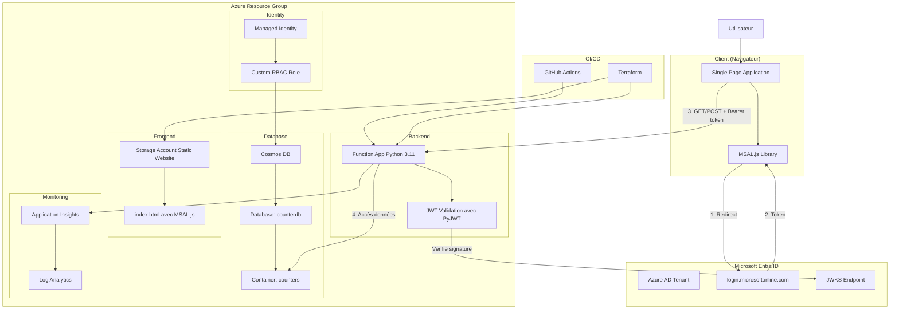
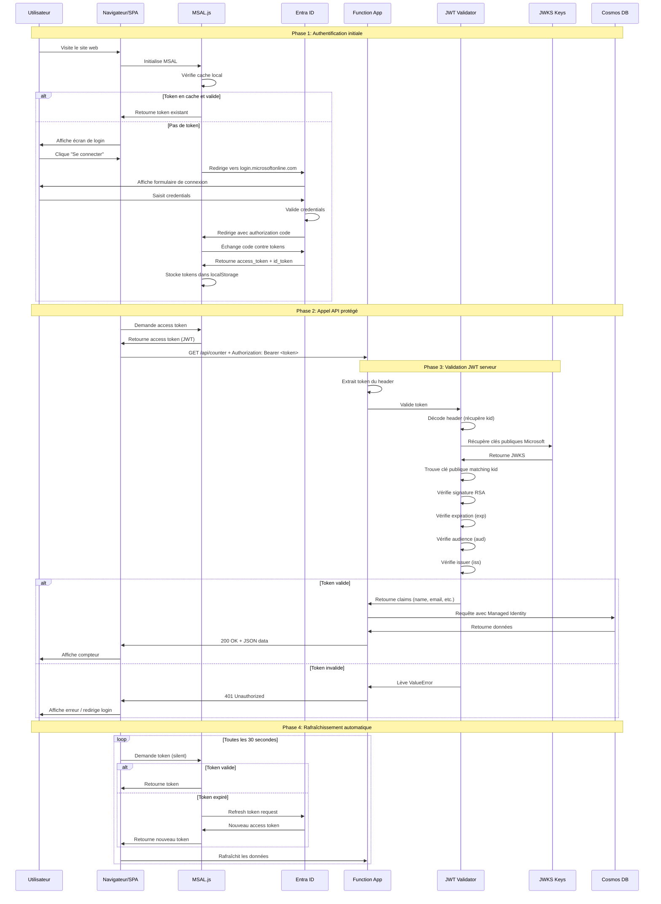

# Documentation: Azure Functions avec Terraform, MSAL.js et GitHub Actions

## Table des matières

- [Vue d'ensemble](#vue-densemble)
- [Architecture du projet](#architecture-du-projet)
- [Authentification avec Microsoft Entra ID](#authentification-avec-microsoft-entra-id)
- [Infrastructure Terraform](#infrastructure-terraform)
- [Site web statique avec MSAL.js](#site-web-statique-avec-msaljs)
- [Validation JWT côté serveur](#validation-jwt-côté-serveur)
- [GitHub Actions CI/CD](#github-actions-cicd)
- [Configuration Entra ID](#configuration-entra-id)
- [Déploiement](#déploiement)
- [Troubleshooting](#troubleshooting)
- [Comparaison AWS](#comparaison-aws)
- [Bonnes pratiques de sécurité](#bonnes-pratiques-de-sécurité)

## Vue d'ensemble

Ce projet déploie une Azure Function App avec authentification OAuth 2.0 / OpenID Connect et un site web statique Single Page Application (SPA). L'architecture utilise **MSAL.js** pour l'authentification côté client et **PyJWT** pour la validation des tokens côté serveur.

### Technologies utilisées

**Frontend:**
- **MSAL.js v2**: Bibliothèque Microsoft pour l'authentification OAuth 2.0 / OIDC
- **Tailwind CSS**: Framework CSS via CDN
- **Azure Storage Static Website**: Hébergement statique pour la SPA

**Backend:**
- **Azure Functions Python 3.11**: Runtime serverless avec plan Consumption (Y1)
- **PyJWT**: Validation des tokens JWT avec vérification de signature RSA
- **Azure Cosmos DB**: Base de données NoSQL avec accès via Managed Identity
- **Application Insights**: Monitoring et télémétrie

**Infrastructure:**
- **Terraform**: Infrastructure as Code
- **GitHub Actions**: CI/CD automatisé
- **Microsoft Entra ID**: Identity provider (anciennement Azure AD)

### Pourquoi MSAL.js au lieu de auth_settings_v2 ?

| Critère | auth_settings_v2 (Easy Auth) | MSAL.js + JWT |
|---------|------------------------------|---------------|
| **Architecture** | Routes `/.auth/*` sur Function App | Auth côté client, validation serveur |
| **Domaines** | Nécessite même domaine ou CORS complexe | Fonctionne cross-domain naturellement |
| **SPA Support** | Limité, conçu pour apps serveur | Natif, conçu pour SPA |
| **Flexibilité** | Configuration limitée | Contrôle total du flow |
| **Standard** | Propriétaire Azure | OAuth 2.0 / OIDC (standard industrie) |
| **Complexité** | Simple mais rigide | Plus de code mais plus flexible |

## Architecture du projet

### Structure des fichiers

```
AZURE_FUNCTION/
├── .github/
│   └── workflows/
│       └── azure-function-app-python.yml  # Pipeline GitHub Actions
├── terraform/
│   ├── app_function.tf             # Function App (sans auth_settings_v2)
│   ├── staticweb_sa.tf             # Storage Account + déploiement HTML
│   ├── cosmos.tf                   # Ressources Cosmos DB
│   ├── github.tf                   # Configuration RBAC GitHub Actions
│   ├── variables.tf                # Variables (tenant_id, entra_client_id)
│   ├── outputs.tf                  # Outputs Terraform
│   ├── data.tf                     # Sources de données
│   ├── random.tf                   # Ressources aléatoires
│   ├── terraform.tf                # Configuration Terraform
│   └── terraform.tfvars            # Valeurs des variables
├── website/
│   └── index.html                  # SPA avec MSAL.js + Tailwind CSS
├── function_app.py                 # Code Python avec validation JWT
├── host.json                       # Configuration Azure Functions
├── requirements.txt                # Dépendances (PyJWT, requests, etc.)
├── local.settings.json             # Configuration locale (dev)
└── README.md                       # Documentation
```

### Architecture complète



### Flux d'authentification complet



## Authentification avec Microsoft Entra ID

### Vue d'ensemble de l'architecture OAuth 2.0

Ce projet utilise le **Authorization Code Flow avec PKCE** (Proof Key for Code Exchange), recommandé pour les Single Page Applications.

**Composants clés:**
- **Client ID**: Identifiant public de l'application (pas de secret)
- **Tenant ID**: Identifiant de l'organisation Azure AD
- **Redirect URI**: URL de retour après authentification
- **Scopes**: Permissions demandées (`api://<client-id>/user_impersonation`)

### Types de tokens

| Token | Rôle | Durée de vie | Stockage |
|-------|------|--------------|----------|
| **Access Token** | Appels API | 1 heure | localStorage |
| **ID Token** | Infos utilisateur | 1 heure | localStorage |
| **Refresh Token** | Renouvellement | 90 jours | localStorage (httpOnly impossible en SPA) |

### Différences avec AWS

| Azure | AWS | Rôle |
|-------|-----|------|
| Microsoft Entra ID | Amazon Cognito | Identity Provider |
| App Registration | User Pool + App Client | Configuration OAuth |
| MSAL.js | AWS Amplify / amazon-cognito-identity-js | Bibliothèque auth |
| Scopes API | Custom scopes | Permissions |
| JWKS Keys | Cognito JWKS | Clés publiques |

## Infrastructure Terraform

### Modifications pour MSAL.js

#### 1. Function App (app_function.tf)

**Changements principaux:**
- Suppression du bloc `auth_settings_v2` (plus nécessaire)
- Ajout de `TENANT_ID` et `ENTRA_CLIENT_ID` dans `app_settings`
- CORS simplifié sans `support_credentials`

```hcl
resource "azurerm_linux_function_app" "vladimirpoutine69" {
  # ... configuration standard ...

  site_config {
    application_insights_connection_string = azurerm_application_insights.vladimirpoutine69.connection_string
    application_insights_key               = azurerm_application_insights.vladimirpoutine69.instrumentation_key

    application_stack {
      python_version = var.runtime_version
    }

    # CORS simplifié pour Bearer tokens (pas de cookies)
    cors {
      allowed_origins = [
        "https://staticvladimirpoutine69.z28.web.core.windows.net"
      ]
      support_credentials = false  # Pas besoin avec Bearer tokens
    }
  }

  # PAS de auth_settings_v2 - Auth gérée par MSAL.js + JWT

  app_settings = {
    # Cosmos DB
    "COSMOS_DB_ENDPOINT"             = azurerm_cosmosdb_account.counter_db.endpoint
    "COSMOS_DB_DATABASE"             = azurerm_cosmosdb_sql_database.counter_database.name
    "COSMOS_DB_CONTAINER"            = azurerm_cosmosdb_sql_container.counter_container.name
    "COSMOS_DB_USE_MANAGED_IDENTITY" = "true"

    # Variables pour validation JWT
    "TENANT_ID"       = var.tenant_id
    "ENTRA_CLIENT_ID" = var.entra_client_id
  }
}
```

#### 2. Static Website (staticweb_sa.tf)

**Changements principaux:**
- Upload de `index.html` avec injection des valeurs Entra ID
- Triple `replace()` pour CLIENT_ID, TENANT_ID et API_URL
- Suppression du CORS (géré par MSAL côté client)

```hcl
resource "azurerm_storage_account" "static_website" {
  name                     = "static${var.sa_staticweb_name}"
  resource_group_name      = azurerm_resource_group.vladimirpoutine69.name
  location                 = azurerm_resource_group.vladimirpoutine69.location
  account_tier             = "Standard"
  account_replication_type = "LRS"
}

resource "azurerm_storage_blob" "index_html" {
  name                   = "index.html"
  storage_account_name   = azurerm_storage_account.static_website.name
  storage_container_name = "$web"
  type                   = "Block"
  content_type           = "text/html"

  # Triple replacement pour injection des valeurs
  source_content = replace(
    replace(
      replace(
        file("${path.module}/../website/index.html"),
        "VOTRE_CLIENT_ID",
        var.entra_client_id
      ),
      "VOTRE_TENANT_ID",
      var.tenant_id
    ),
    "API_URL_PLACEHOLDER",
    "https://${azurerm_linux_function_app.vladimirpoutine69.default_hostname}"
  )
}
```

#### 3. Variables (variables.tf)

**Nouvelles variables:**

```hcl
variable "tenant_id" {
  description = "Azure AD Tenant ID"
  type        = string
}

variable "entra_client_id" {
  description = "Entra ID Client ID pour l'application"
  type        = string
}

# SUPPRIMÉ: variable "entra_client_secret" (pas de secret en SPA)
```

#### 4. Valeurs (terraform.tfvars)

```hcl
tenant_id        = "xxxxxxxx-xxxx-xxxx-xxxx-xxxxxxxxxxxx"
entra_client_id  = "yyyyyyyy-yyyy-yyyy-yyyy-yyyyyyyyyyyy"

# Plus besoin de entra_client_secret
```

### Ressources Cosmos DB

Configuration inchangée - utilise toujours Managed Identity pour l'accès sécurisé.

```hcl
# Custom Role Definition
resource "azurerm_cosmosdb_sql_role_definition" "counter_admin" {
  name                = "counter-admin"
  resource_group_name = azurerm_resource_group.vladimirpoutine69.name
  account_name        = azurerm_cosmosdb_account.counter_db.name
  type               = "CustomRole"
  assignable_scopes  = [azurerm_cosmosdb_account.counter_db.id]

  permissions {
    data_actions = [
      "Microsoft.DocumentDB/databaseAccounts/readMetadata",
      "Microsoft.DocumentDB/databaseAccounts/sqlDatabases/containers/*",
      "Microsoft.DocumentDB/databaseAccounts/sqlDatabases/containers/items/*"
    ]
  }
}

# Role Assignment vers Function App
resource "azurerm_cosmosdb_sql_role_assignment" "function_cosmos_access_v2" {
  resource_group_name = azurerm_resource_group.vladimirpoutine69.name
  account_name        = azurerm_cosmosdb_account.counter_db.name
  scope              = azurerm_cosmosdb_account.counter_db.id
  role_definition_id = azurerm_cosmosdb_sql_role_definition.counter_admin.id
  principal_id       = azurerm_linux_function_app.vladimirpoutine69.identity[0].principal_id
}
```

## Site web statique avec MSAL.js

### Structure du fichier index.html

Le fichier `website/index.html` contient tout : HTML, CSS (Tailwind CDN), JavaScript (MSAL.js).

**Sections principales:**

1. **Configuration MSAL**
```javascript
const msalConfig = {
    auth: {
        clientId: "VOTRE_CLIENT_ID",  // Remplacé par Terraform
        authority: "https://login.microsoftonline.com/VOTRE_TENANT_ID",
        redirectUri: window.location.origin
    },
    cache: {
        cacheLocation: "localStorage",
        storeAuthStateInCookie: false
    }
};
```

2. **Scopes API**
```javascript
const loginRequest = {
    scopes: ["api://VOTRE_CLIENT_ID/user_impersonation"]
};
```

3. **Initialisation**
```javascript
async function initialize() {
    const response = await msalInstance.handleRedirectPromise();
    if (response) {
        currentAccount = response.account;
    } else {
        const accounts = msalInstance.getAllAccounts();
        if (accounts.length > 0) {
            currentAccount = accounts[0];
        }
    }
    
    if (currentAccount) {
        showAuthenticatedView();
        await loadCounter();
    } else {
        showLoginScreen();
    }
}
```

4. **Obtention du token**
```javascript
async function getAccessToken() {
    const request = {
        ...loginRequest,
        account: currentAccount
    };

    try {
        // Tentative silencieuse (cache)
        const response = await msalInstance.acquireTokenSilent(request);
        return response.accessToken;
    } catch (error) {
        // Si échec, redirection interactive
        await msalInstance.acquireTokenRedirect(request);
    }
}
```

5. **Appels API avec token**
```javascript
async function loadCounter() {
    const token = await getAccessToken();
    
    const response = await fetch(`${API_URL}`, {
        method: 'GET',
        headers: {
            'Authorization': `Bearer ${token}`,
            'Accept': 'application/json'
        }
    });
    
    const data = await response.json();
    // Affichage des données
}
```

### Gestion des erreurs

**401 Unauthorized** : Token expiré ou invalide → Redirection login
```javascript
if (response.status === 401) {
    window.location.href = '/.auth/login/aad';  // Ou redemander token
    return;
}
```

**Network errors** : Affichage d'un toast d'erreur
```javascript
catch (error) {
    showToast(`Erreur: ${error.message}`, 'error');
}
```

## Validation JWT côté serveur

### Architecture de la validation

Le fichier `function_app.py` implémente une validation JWT complète en 4 étapes :

1. **Extraction du token** du header `Authorization: Bearer <token>`
2. **Récupération des clés publiques** Microsoft (JWKS)
3. **Vérification de la signature** RSA avec la clé publique
4. **Validation des claims** (expiration, audience, issuer)

### Code de validation

```python
import jwt
import requests
from functools import wraps

# Configuration
TENANT_ID = os.environ.get('TENANT_ID')
CLIENT_ID = os.environ.get('ENTRA_CLIENT_ID')
ISSUER = f"https://login.microsoftonline.com/{TENANT_ID}/v2.0"

def get_jwks():
    """Récupère les clés publiques Microsoft"""
    global _jwks_cache
    if _jwks_cache is None:
        jwks_uri = f"https://login.microsoftonline.com/{TENANT_ID}/discovery/v2.0/keys"
        response = requests.get(jwks_uri)
        _jwks_cache = response.json()
    return _jwks_cache

def validate_token(token: str) -> dict:
    """Valide un token JWT"""
    # Décoder le header pour obtenir le kid
    unverified_header = jwt.get_unverified_header(token)
    kid = unverified_header.get('kid')
    
    # Trouver la clé publique correspondante
    jwks = get_jwks()
    public_key = None
    for key in jwks.get('keys', []):
        if key.get('kid') == kid:
            public_key = jwt.algorithms.RSAAlgorithm.from_jwk(json.dumps(key))
            break
    
    # Valider le token avec la clé publique
    decoded = jwt.decode(
        token,
        public_key,
        algorithms=['RS256'],
        audience=f"api://{CLIENT_ID}",
        issuer=ISSUER,
        options={
            "verify_signature": True,
            "verify_exp": True,
            "verify_aud": True,
            "verify_iss": True
        }
    )
    
    return decoded
```

### Décorateur de protection

```python
def require_auth(handler):
    """Décorateur pour protéger les routes"""
    @wraps(handler)
    def wrapper(req: func.HttpRequest) -> func.HttpResponse:
        auth_header = req.headers.get('Authorization', '')
        
        if not auth_header.startswith('Bearer '):
            return func.HttpResponse(
                json.dumps({"error": "Authentification requise"}),
                status_code=401,
                headers={'Access-Control-Allow-Origin': req.headers.get('Origin', '*')}
            )
        
        token = auth_header.replace('Bearer ', '')
        
        try:
            claims = validate_token(token)
            req.claims = claims  # Ajouter les claims à la requête
            return handler(req)
        except ValueError as e:
            return func.HttpResponse(
                json.dumps({"error": f"Token invalide: {str(e)}"}),
                status_code=401,
                headers={'Access-Control-Allow-Origin': req.headers.get('Origin', '*')}
            )
    
    return wrapper
```

### Routes protégées

```python
@app.route(route="counter", methods=["OPTIONS"])
def counter_preflight(req):
    """Route publique pour CORS"""
    return func.HttpResponse(
        status_code=204,
        headers={
            'Access-Control-Allow-Origin': req.headers.get('Origin', '*'),
            'Access-Control-Allow-Methods': 'GET, POST, OPTIONS',
            'Access-Control-Allow-Headers': 'Content-Type, Authorization',
            'Access-Control-Max-Age': '3600'
        }
    )

@app.route(route="counter", methods=["GET", "POST"])
@require_auth  # Protection JWT
def counter(req):
    """Route protégée"""
    user_name = req.claims.get('name', 'unknown')
    user_email = req.claims.get('email', 'unknown')
    
    # Logique métier...
```

### Extraction des informations utilisateur

Les claims JWT contiennent les infos de l'utilisateur :

```python
claims = {
    'aud': 'api://xxxxxxxx-xxxx-xxxx-xxxx-xxxxxxxxxxxx',
    'iss': 'https://login.microsoftonline.com/.../v2.0',
    'iat': 1234567890,
    'exp': 1234571490,
    'name': 'John Doe',
    'preferred_username': 'john.doe@domain.com',
    'email': 'john.doe@domain.com',
    'oid': 'yyyyyyyy-yyyy-yyyy-yyyy-yyyyyyyyyyyy',
    'tid': 'zzzzzzzz-zzzz-zzzz-zzzz-zzzzzzzzzzzz'
}

user_name = claims.get('name', claims.get('preferred_username', 'unknown'))
```

## GitHub Actions CI/CD

### Configuration du pipeline

Le fichier `.github/workflows/azure-function-app-python.yml` déploie automatiquement le code Python.

**Déclencheurs:**
```yaml
on:
  push:
    branches: ["main", "je_lis_la_doc_zzzz"]
```

### Étapes de déploiement

1. **Checkout du code**
2. **Login Azure** avec RBAC credentials
3. **Setup Python 3.11**
4. **Installation des dépendances** (PyJWT, requests, etc.)
5. **Création du ZIP** (exclut .git, venv, etc.)
6. **Déploiement** via `az functionapp deployment source config-zip`

### Dépendances Python (requirements.txt)

```txt
azure-functions
azure-cosmos
azure-identity
PyJWT>=2.8.0
cryptography>=41.0.0
requests>=2.31.0
```

**Critiques pour MSAL.js:**
- `PyJWT`: Validation des tokens JWT
- `cryptography`: Vérification des signatures RSA
- `requests`: Récupération des clés publiques Microsoft

### Secrets GitHub nécessaires

- `AZURE_RBAC_CREDENTIALS`: Credentials du service principal (JSON complet)

## Configuration Entra ID

### Étape 1 : Créer l'App Registration

**Portail Azure → Microsoft Entra ID → App registrations → New registration**

| Champ | Valeur |
|-------|--------|
| Name | `counter-app-msal` |
| Supported account types | `Accounts in this organizational directory only` |
| Redirect URI | Type: **Single-page application (SPA)** |
|  | URL: `https://staticvladimirpoutine69.z28.web.core.windows.net` |

**Récupérer:**
- Application (client) ID
- Directory (tenant) ID

### Étape 2 : Configurer l'authentification

**Authentication → Single-page application:**
- Ajouter URI: `https://staticvladimirpoutine69.z28.web.core.windows.net`
- Ajouter URI: `http://localhost:7071` (dev local)
- Cocher: **Access tokens** et **ID tokens**

### Étape 3 : Exposer l'API

**Expose an API → Add a scope:**

| Champ | Valeur |
|-------|--------|
| Application ID URI | `api://<client-id>` |
| Scope name | `user_impersonation` |
| Who can consent? | `Admins and users` |
| Display name | `Access counter API` |

### Étape 4 : Ajouter les permissions

**API permissions → Add a permission → My APIs:**
- Sélectionner ton app
- Cocher `user_impersonation`
- **Grant admin consent** (important !)

### Étape 5 : Mettre à jour Terraform

```hcl
# terraform/terraform.tfvars
tenant_id        = "ton-tenant-id-depuis-entra"
entra_client_id  = "ton-client-id-depuis-entra"
```

## Déploiement

### Ordre de déploiement

```bash
# 1. Déployer l'infrastructure
cd terraform
terraform init
terraform plan
terraform apply -auto-approve

# 2. Commit et push le code Python
cd ..
git add function_app.py requirements.txt website/index.html
git commit -m "feat: MSAL.js authentication with JWT validation"
git push origin main

# 3. Attendre le déploiement GitHub Actions (3-5 min)

# 4. Tester l'application
open https://staticvladimirpoutine69.z28.web.core.windows.net
```

### Vérifications post-déploiement

```bash
# Vérifier que les variables d'environnement sont configurées
az functionapp config appsettings list \
  --name vladimirpoutine69 \
  --resource-group rg-vladimirpoutine69 \
  --query "[?name=='TENANT_ID' || name=='ENTRA_CLIENT_ID']"

# Vérifier l'URL du site web
terraform output primary_web_endpoint

# Tester la route OPTIONS (CORS)
curl -i -X OPTIONS \
  -H "Origin: https://staticvladimirpoutine69.z28.web.core.windows.net" \
  https://vladimirpoutine69.azurewebsites.net/api/counter
```

## Troubleshooting

### Erreur : AADSTS65001 (User or administrator has not consented)

**Cause:** Permissions API non accordées

**Solution:**
```bash
# Portail Azure → Entra ID → App registrations → ton app
# → API permissions → Grant admin consent
```

### Erreur : Invalid audience

**Cause:** Mismatch entre scope et audience

**Vérifier:**
- `index.html`: `scopes: ["api://<CLIENT_ID>/user_impersonation"]`
- `function_app.py`: `audience=f"api://{CLIENT_ID}"`
- Les deux CLIENT_ID doivent matcher

### Erreur : Token validation failed

**Cause:** Configuration JWT incorrecte

**Vérifier:**
```bash
# Variables d'environnement dans Function App
az functionapp config appsettings list \
  --name vladimirpoutine69 \
  --resource-group rg-vladimirpoutine69
```

### Erreur CORS persiste

**Cause:** Headers CORS manquants

**Vérifier:**
```python
# Toutes les réponses doivent avoir :
headers={
    'Access-Control-Allow-Origin': req.headers.get('Origin', '*')
}
```

### La page reste sur "Initialisation..."

**Cause:** Placeholders non remplacés par Terraform

**Vérifier:**
```bash
# Télécharger le HTML déployé
curl https://staticvladimirpoutine69.z28.web.core.windows.net/index.html > deployed.html

# Chercher les placeholders
grep "VOTRE_CLIENT_ID" deployed.html  # Ne doit rien retourner
grep "API_URL_PLACEHOLDER" deployed.html  # Ne doit rien retourner
```

## Comparaison AWS

| Concept | Azure | AWS |
|---------|-------|-----|
| **Identity Provider** | Microsoft Entra ID | Amazon Cognito |
| **App Configuration** | App Registration | User Pool + App Client |
| **Auth Library** | MSAL.js | AWS Amplify / amazon-cognito-identity-js |
| **Token Type** | JWT (RS256) | JWT (RS256) |
| **Token Validation** | PyJWT + Microsoft JWKS | python-jose + Cognito JWKS |
| **Scopes** | `api://<client-id>/scope` | Custom scopes |
| **Static Hosting** | Azure Storage Static Website | S3 Static Website Hosting |
| **Serverless** | Azure Functions | AWS Lambda + API Gateway |
| **NoSQL Database** | Cosmos DB | DynamoDB |
| **IaC** | Terraform (azurerm provider) | Terraform (aws provider) / CloudFormation |
| **CI/CD** | GitHub Actions + Azure CLI | GitHub Actions + AWS CLI |

### Code équivalent AWS

**Cognito Token Validation (Lambda):**
```python
from jose import jwt
import requests

REGION = 'us-east-1'
USER_POOL_ID = 'us-east-1_XXXXXXXXX'
APP_CLIENT_ID = 'your-app-client-id'
JWKS_URL = f'https://cognito-idp.{REGION}.amazonaws.com/{USER_POOL_ID}/.well-known/jwks.json'

def validate_token(token):
    jwks = requests.get(JWKS_URL).json()
    # Similar validation logic avec jose au lieu de PyJWT
```

## Bonnes pratiques de sécurité

### Checklist de sécurité

- [ ] `@require_auth` sur toutes les routes sensibles
- [ ] Validation JWT complète (signature, expiration, audience, issuer)
- [ ] Variables `TENANT_ID` et `ENTRA_CLIENT_ID` correctes dans app settings
- [ ] Tests de sécurité passés (appels sans token retournent 401)
- [ ] Logs activés dans Application Insights
- [ ] Pas de tokens en clair dans les logs
- [ ] HTTPS uniquement (automatique avec Azure)
- [ ] Scope API minimal requis (`user_impersonation`)
- [ ] Admin consent accordé dans Entra ID
- [ ] Managed Identity pour Cosmos DB (pas de clés)

### Rotation des secrets

**Tokens JWT:**
- Expiration automatique (1 heure)
- Refresh automatique par MSAL.js
- Révocation immédiate possible via Entra ID

**Managed Identity:**
- Pas de secrets à gérer
- Rotation automatique par Azure

**Clés publiques Microsoft:**
- Rotation automatique
- Cache avec invalidation régulière recommandé

### Monitoring et audit

**Application Insights:**
```bash
# Voir les logs de validation JWT
az monitor app-insights query \
  --app vladimirpoutine69 \
  --analytics-query "traces | where message contains 'Token validé' | take 10"
```

**Entra ID Sign-in Logs:**
- Portail Azure → Entra ID → Monitoring → Sign-in logs
- Filtrer par Application: `counter-app-msal`

### Principe du moindre privilège

**Scopes API:**
- Utiliser des scopes spécifiques pour chaque action
- Exemple: `api://<client-id>/counter.read` et `api://<client-id>/counter.write`

**Cosmos DB:**
- Utiliser un rôle custom avec permissions minimales
- Ne jamais utiliser de clés partagées en production

## Coûts estimés

### Ressources principales

| Ressource | Coût mensuel estimé | Notes |
|-----------|---------------------|-------|
| Function App (Y1) | ~0€ | 1M exécutions gratuites/mois |
| Storage Account (Functions) | ~0.02€/GB | Stockage du code |
| Storage Account (Static Website) | ~0.02€/GB + 0.0004€/10k requêtes | Hébergement SPA |
| Cosmos DB | ~24€ | 400 RU/s provisionnées |
| Application Insights | Gratuit | Jusqu'à 5GB/mois |
| Log Analytics | ~2.30€/GB | Après 5GB gratuits |
| Transfert données | Gratuit | Premier 5GB/mois |
| **Entra ID (Azure AD)** | **Gratuit** | Inclus avec abonnement Azure |
| **TOTAL** | **~26€/mois** | Pour usage faible/moyen |

### Optimisations possibles

- Réduire les RU/s Cosmos DB à 400 RU/s minimum
- Auto-scaling Cosmos DB pour trafic variable
- Lifecycle policies pour les logs anciens
- CDN pour Static Website (amélioration perf)

### Équivalent AWS

| Azure | AWS | Coût AWS |
|-------|-----|----------|
| Function App Y1 | Lambda | ~0€ (1M requêtes gratuites) |
| Cosmos DB | DynamoDB | ~25€ (provisioned) ou ~0€ (on-demand faible trafic) |
| Storage Static | S3 Static | ~0.023€/GB + 0.0004€/1k GET |
| Entra ID | Cognito | Gratuit jusqu'à 50k MAU |
| Application Insights | CloudWatch | ~0.50€/GB après 5GB |

---

**Version de la documentation:** 2.0 - MSAL.js + JWT  
**Dernière mise à jour:** 2025  
**Auteur:** Documentation générée pour projet Azure Functions

Pour toute question ou contribution, consulter le README.md du projet.