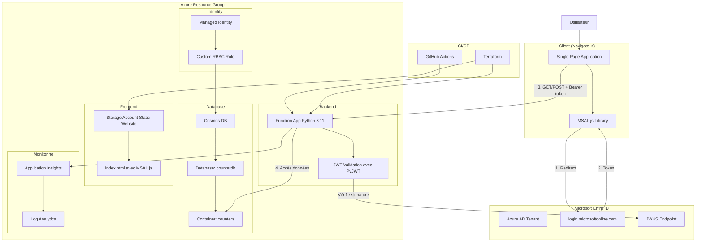
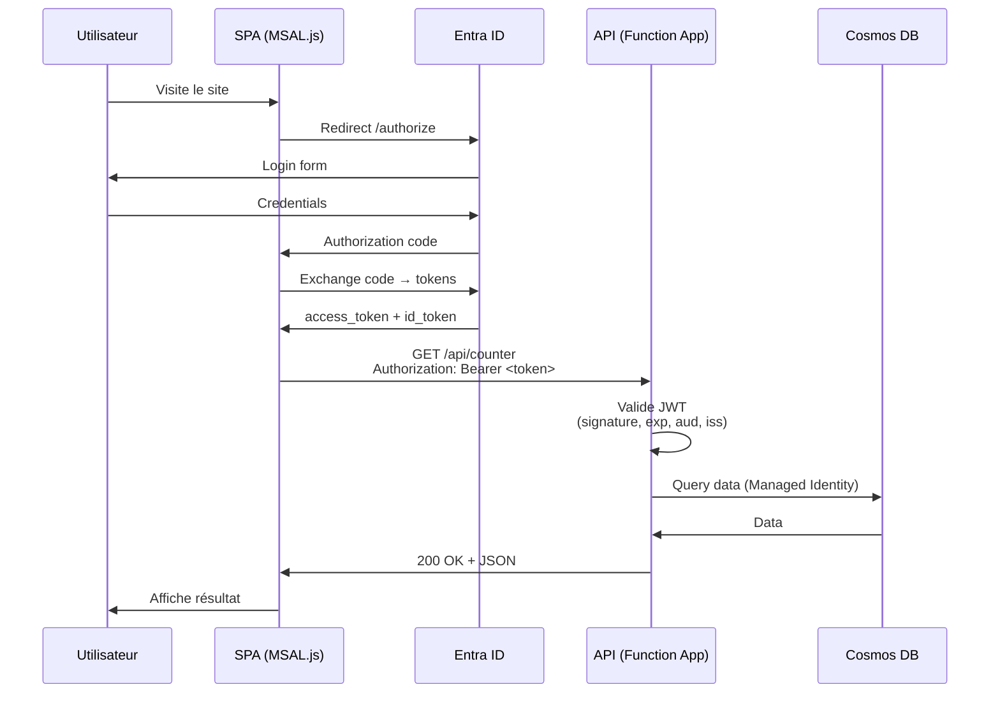

# Documentation: Authentification Azure Functions avec MSAL.js

## Table des matières

- [Vue d'ensemble](#vue-densemble)
- [Architecture OAuth 2.0](#architecture-oauth-20)
- [Configuration Entra ID](#configuration-entra-id)
- [Infrastructure Terraform](#infrastructure-terraform)
- [Site web avec MSAL.js](#site-web-avec-msaljs)
- [Validation JWT serveur](#validation-jwt-serveur)
- [Déploiement](#déploiement)
- [Troubleshooting](#troubleshooting)
- [Comparaison AWS](#comparaison-aws)

## Vue d'ensemble

Ce projet implémente l'authentification OAuth 2.0 / OpenID Connect avec **MSAL.js** côté client et **PyJWT** côté serveur pour une Azure Function App.

### Pourquoi MSAL.js ?

| Critère | auth_settings_v2 | MSAL.js + JWT |
|---------|------------------|---------------|
| **Architecture** | Routes `/.auth/*` sur Function App | Auth côté client ✅ |
| **Cross-domain** | Problématique avec CORS | Fonctionne nativement ✅ |
| **SPA Support** | Limité | Natif ✅ |
| **Standard** | Propriétaire Azure | OAuth 2.0 (universel) ✅ |

### Technologies

- **Frontend** : MSAL.js v2 + Tailwind CSS
- **Backend** : Python 3.11 + PyJWT
- **Identity Provider** : Microsoft Entra ID (Azure AD)
- **Infrastructure** : Terraform + GitHub Actions

## Architecture OAuth 2.0

### Architecture complète



### Flux d'authentification



### Types de tokens

| Token | Rôle | Durée | Format |
|-------|------|-------|--------|
| Access Token | Appels API | 1h | JWT (RS256) |
| ID Token | Infos utilisateur | 1h | JWT (RS256) |
| Refresh Token | Renouvellement | 90j | Opaque |

### Tokens v1.0 vs v2.0

**Important** : Entra ID peut émettre des tokens v1.0 ou v2.0 selon la configuration.

| Aspect | v1.0 | v2.0 |
|--------|------|------|
| **Issuer** | `https://sts.windows.net/{tenant}/` | `https://login.microsoftonline.com/{tenant}/v2.0` |
| **JWKS URL** | `/discovery/keys` | `/discovery/v2.0/keys` |
| **Endpoint** | `/oauth2/` | `/oauth2/v2.0/` |

**Notre projet utilise des tokens v1.0** (configuration par défaut pour Single Tenant).

Les clés JWKS sont **les mêmes** pour v1.0 et v2.0, donc on peut utiliser l'endpoint v2.0 pour récupérer les clés même avec des tokens v1.0.

## Configuration Entra ID

### Étape 1 : App Registration

**Portail Azure → Entra ID → App registrations → New registration**

```
Name: counter-app-msal
Account types: Single tenant
Redirect URI: 
  Type: Single-page application (SPA)
  URL: https://staticvladimirpoutine69.z28.web.core.windows.net
```

**Récupérer :**
- Application (client) ID
- Directory (tenant) ID

### Étape 2 : Authentication

**Authentication → Platform configurations → SPA**

Redirect URIs :
```
https://staticvladimirpoutine69.z28.web.core.windows.net
http://localhost:7071 (dev local)
```

Implicit grant :
- ☑️ Access tokens
- ☑️ ID tokens

### Étape 3 : Expose API

**Expose an API → Add a scope**

```
Application ID URI: api://<client-id>
Scope name: user_impersonation
Who can consent: Admins and users
Admin consent display name: Access counter API
```

### Étape 4 : API Permissions

**API permissions → Add permission → My APIs**

- Sélectionner votre app
- ☑️ user_impersonation
- **Grant admin consent** ← Important !

### Étape 5 : Vérifier le token

Après configuration, vérifier l'issuer du token :

```javascript
// Console du navigateur après login
const token = await getAccessToken();
const parts = token.split('.');
const payload = JSON.parse(atob(parts[1]));
console.log("Issuer:", payload.iss);
```

Si l'issuer est `https://sts.windows.net/...`, c'est un token **v1.0** (notre cas).

## Infrastructure Terraform

### Variables (terraform.tfvars)

```hcl
tenant_id       = "901cb4ca-b862-4029-9306-e5cd0f6d9f86"
entra_client_id = "f6fe2ea9-9292-482f-9eb7-b60f58c39207"

# Plus de entra_client_secret (SPA = public client)
```

### Function App (app_function.tf)

```hcl
resource "azurerm_linux_function_app" "vladimirpoutine69" {
  # ... config standard ...

  site_config {
    application_stack {
      python_version = var.runtime_version
    }

    # CORS avec origine exacte (sans trailing slash)
    cors {
      allowed_origins = [
        trimsuffix(azurerm_storage_account.static_website.primary_web_endpoint, "/")
      ]
      support_credentials = false  # Pas de cookies avec Bearer tokens
    }
  }

  # PAS de auth_settings_v2 - Auth gérée par MSAL.js

  app_settings = {
    "COSMOS_DB_ENDPOINT"             = azurerm_cosmosdb_account.counter_db.endpoint
    "COSMOS_DB_DATABASE"             = azurerm_cosmosdb_sql_database.counter_database.name
    "COSMOS_DB_CONTAINER"            = azurerm_cosmosdb_sql_container.counter_container.name
    "COSMOS_DB_USE_MANAGED_IDENTITY" = "true"

    # Variables pour validation JWT
    "TENANT_ID"       = var.tenant_id
    "ENTRA_CLIENT_ID" = var.entra_client_id
  }
}
```

### Static Website (staticweb_sa.tf)

```hcl
resource "azurerm_storage_blob" "index_html" {
  name                   = "index.html"
  storage_account_name   = azurerm_storage_account.static_website.name
  storage_container_name = "$web"
  type                   = "Block"
  content_type           = "text/html"

  # Triple replacement : CLIENT_ID, TENANT_ID, API_URL
  source_content = replace(
    replace(
      replace(
        file("${path.module}/../website/index.html"),
        "COUNTER_CLIENT_ID",
        var.entra_client_id
      ),
      "COUNTER_TENANT_ID",
      var.tenant_id
    ),
    "COUNTER_API_URL",
    "https://${azurerm_linux_function_app.vladimirpoutine69.default_hostname}"
  )
}
```

## Site web avec MSAL.js

### Configuration (index.html)

```javascript
const msalConfig = {
    auth: {
        clientId: "COUNTER_CLIENT_ID",  // Remplacé par Terraform
        authority: "https://login.microsoftonline.com/COUNTER_TENANT_ID",
        redirectUri: window.location.origin
    },
    cache: {
        cacheLocation: "localStorage",
        storeAuthStateInCookie: false
    }
};

const loginRequest = {
    scopes: ["api://COUNTER_CLIENT_ID/user_impersonation"]
};

const API_URL = 'COUNTER_API_URL/api/counter';
```

### Obtention du token

```javascript
async function getAccessToken() {
    const request = {
        ...loginRequest,
        account: currentAccount
    };

    try {
        // Tentative silencieuse (cache)
        const response = await msalInstance.acquireTokenSilent(request);
        return response.accessToken;
    } catch (error) {
        // Si échec, redirect interactif
        await msalInstance.acquireTokenRedirect(request);
    }
}
```

### Appels API

```javascript
async function loadCounter() {
    const token = await getAccessToken();
    
    const response = await fetch(API_URL, {
        method: 'GET',
        headers: {
            'Authorization': `Bearer ${token}`,
            'Accept': 'application/json'
        }
    });
    
    const data = await response.json();
    // ...
}
```

## Validation JWT serveur

### Configuration Python

```python
import jwt
import requests
from functools import wraps

TENANT_ID = os.environ.get('TENANT_ID')
CLIENT_ID = os.environ.get('ENTRA_CLIENT_ID')

# ⚠️ IMPORTANT : Utiliser v1.0 issuer (sts.windows.net)
ISSUER = f"https://sts.windows.net/{TENANT_ID}/"

# JWKS peut rester en v2.0 (mêmes clés)
_jwks_cache = None

def get_jwks():
    global _jwks_cache
    if _jwks_cache is None:
        jwks_uri = f"https://login.microsoftonline.com/{TENANT_ID}/discovery/v2.0/keys"
        response = requests.get(jwks_uri)
        _jwks_cache = response.json()
    return _jwks_cache
```

### Validation du token

```python
def validate_token(token: str) -> dict:
    # 1. Décoder header pour obtenir kid
    unverified_header = jwt.get_unverified_header(token)
    kid = unverified_header.get('kid')
    
    # 2. Trouver la clé publique
    jwks = get_jwks()
    public_key = None
    for key in jwks.get('keys', []):
        if key.get('kid') == kid:
            public_key = jwt.algorithms.RSAAlgorithm.from_jwk(json.dumps(key))
            break
    
    # 3. Valider le token
    decoded = jwt.decode(
        token,
        public_key,
        algorithms=['RS256'],
        audience=f"api://{CLIENT_ID}",
        issuer=ISSUER,  # ⚠️ Doit matcher celui du token
        options={
            "verify_signature": True,
            "verify_exp": True,
            "verify_aud": True,
            "verify_iss": True
        }
    )
    
    return decoded
```

### Décorateur de protection

```python
def require_auth(handler):
    @wraps(handler)
    def wrapper(req: func.HttpRequest) -> func.HttpResponse:
        auth_header = req.headers.get('Authorization', '')
        
        if not auth_header.startswith('Bearer '):
            return func.HttpResponse(
                json.dumps({"error": "Authentification requise"}),
                status_code=401,
                headers={'Access-Control-Allow-Origin': req.headers.get('Origin', '*')}
            )
        
        token = auth_header.replace('Bearer ', '')
        
        try:
            claims = validate_token(token)
            req.claims = claims
            return handler(req)
        except ValueError as e:
            return func.HttpResponse(
                json.dumps({"error": f"Token invalide: {str(e)}"}),
                status_code=401,
                headers={'Access-Control-Allow-Origin': req.headers.get('Origin', '*')}
            )
    
    return wrapper
```

### Routes

```python
@app.route(route="counter", methods=["OPTIONS"])
def counter_preflight(req):
    """Route publique pour CORS preflight"""
    return func.HttpResponse(
        status_code=204,
        headers={
            'Access-Control-Allow-Origin': req.headers.get('Origin', '*'),
            'Access-Control-Allow-Methods': 'GET, POST, OPTIONS',
            'Access-Control-Allow-Headers': 'Content-Type, Authorization',
            'Access-Control-Max-Age': '3600'
        }
    )

@app.route(route="counter", methods=["GET", "POST"])
@require_auth  # Protection JWT
def counter(req):
    user_name = req.claims.get('name', 'unknown')
    # Logique métier...
```

## Déploiement

### 1. Infrastructure

```bash
cd terraform
terraform init
terraform apply -auto-approve
```

### 2. Code Python

```bash
git add function_app.py requirements.txt
git commit -m "feat: JWT validation with v1.0 tokens"
git push origin main
# GitHub Actions déploie automatiquement
```

### 3. Vérifications

```bash
# Variables d'environnement
az functionapp config appsettings list \
  --name vladimirpoutine69 \
  --resource-group rg-vladimirpoutine69 \
  --query "[?name=='TENANT_ID' || name=='ENTRA_CLIENT_ID']"

# Test CORS preflight
curl -i -X OPTIONS \
  -H "Origin: https://staticvladimirpoutine69.z28.web.core.windows.net" \
  https://vladimirpoutine69.azurewebsites.net/api/counter

# Devrait retourner 204 avec headers CORS
```

## Bonnes pratiques

### Sécurité

- ✅ Utiliser `@require_auth` sur toutes routes sensibles
- ✅ Valider signature + expiration + audience + issuer
- ✅ Pas de secrets côté client (SPA = public client)
- ✅ HTTPS uniquement (automatique avec Azure)
- ✅ Managed Identity pour Cosmos DB
- ✅ Logs de validation dans Application Insights

### Performance

- ✅ Cache JWKS (évite appels répétés à Microsoft)
- ✅ Token refresh automatique par MSAL.js
- ✅ Expiration token : 1h (bon équilibre sécurité/UX)

### Monitoring

```bash
# Voir les validations JWT
az monitor app-insights query \
  --app vladimirpoutine69 \
  --analytics-query "traces | where message contains 'Token validé' | take 10"
```
