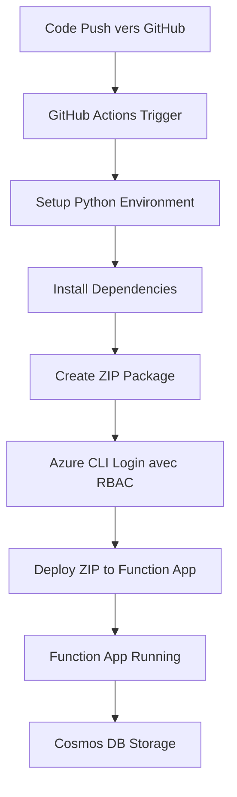

# Documentation: Azure Functions avec Terraform et GitHub Actions

## Table des matières

- [Vue d'ensemble](#vue-densemble)
- [Architecture du projet](#architecture-du-projet)
- [Infrastructure Terraform](#infrastructure-terraform)
- [GitHub Actions CI/CD](#github-actions-cicd)
- [Déploiement et sécurité](#déploiement-et-sécurité)
- [Troubleshooting](#troubleshooting)
- [Bonnes pratiques](#bonnes-pratiques)

## Vue d'ensemble

Ce projet déploie une Azure Function App en utilisant Terraform et un pipeline de déploiement automatisé (GitHub Actions). L'architecture utilise le plan **Consumption Plan (Y1)**

### Technologies utilisées

- **Azure Functions** : Plateforme serverless pour exécuter du code event-driven
- **Azure Cosmos DB** : Base de données NoSQL pour la persistance des données
- **Terraform** : Infrastructure as Code pour provisionner les ressources Azure
- **GitHub Actions** : CI/CD pour automatiser le déploiement
- **Python 3.11** : Runtime de la fonction
- **Azure RBAC** : Authentification sécurisée pour le déploiement

## Architecture du projet

### Structure des fichiers

```
AZURE_FUNCTION/
├── .github/
│   └── workflows/
│       └── azure-function-app-python.yml  # Pipeline GitHub Actions
├── terraform/
│   ├── app_function.tf             # Ressources Function App principales
│   ├── cosmos.tf                   # Ressources Cosmos DB
│   ├── github.tf                   # Configuration RBAC GitHub Actions
│   ├── variables.tf                # Variables Terraform
│   ├── outputs.tf                  # Outputs Terraform
│   ├── data.tf                     # Sources de données
│   ├── random.tf                   # Ressources aléatoires
│   ├── terraform.tf                # Configuration Terraform
│   └── terraform.tfvars            # Valeurs des variables
├── function_app.py                 # Code de la fonction principale
├── host.json                       # Configuration Azure Functions
├── requirements.txt                # Dépendances Python
├── local.settings.json             # Configuration locale (dev)
└── README.md                       # Documentation
```

### Flux de déploiement



## Infrastructure Terraform

### Ressources créées

#### 1. Resource Group
```hcl
resource "azurerm_resource_group" "vladimirpoutine69" {
  location = var.resource_group_location
  name     = coalesce("rg-${var.resource_group_name}", random_pet.rg_name.id)
}
```

**Rôle** : Conteneur logique pour toutes les ressources du projet

#### 2. Storage Account
```hcl
resource "azurerm_storage_account" "vladimirpoutine69" {
  name                     = coalesce(var.sa_name, random_string.name.result)
  resource_group_name      = azurerm_resource_group.vladimirpoutine69.name
  location                 = azurerm_resource_group.vladimirpoutine69.location
  account_tier             = var.sa_account_tier
  account_replication_type = var.sa_account_replication_type
}
```

**Rôle** : 
- Stockage du code de la fonction (deployment packages)
- Stockage des logs et métadonnées
- Support pour les triggers et bindings Azure Functions

**Configuration** :
- Tier : Standard (par défaut)
- Réplication : LRS (Local Redundant Storage)
- Accès public activé pour les déploiements

#### 3. Log Analytics Workspace
```hcl
resource "azurerm_log_analytics_workspace" "vladimirpoutine69" {
  name                = coalesce(var.ws_name, random_string.name.result)
  location            = azurerm_resource_group.vladimirpoutine69.location
  resource_group_name = azurerm_resource_group.vladimirpoutine69.name
  sku                 = "PerGB2018"
  retention_in_days   = 30
}
```

**Rôle** : Collecte et analyse des logs pour Application Insights

#### 4. Application Insights
```hcl
resource "azurerm_application_insights" "vladimirpoutine69" {
  name                = coalesce(var.ai_name, random_string.name.result)
  location            = azurerm_resource_group.vladimirpoutine69.location
  resource_group_name = azurerm_resource_group.vladimirpoutine69.name
  application_type    = "web"
  workspace_id        = azurerm_log_analytics_workspace.vladimirpoutine69.id
}
```

**Rôle** : 
- Monitoring des performances
- Collecte des logs applicatifs
- Debugging et diagnostics

#### 5. Service Plan (Consumption Y1)
```hcl
resource "azurerm_service_plan" "vladimirpoutine69" {
  name                = coalesce(var.asp_name, random_string.name.result)
  resource_group_name = azurerm_resource_group.vladimirpoutine69.name
  location            = azurerm_resource_group.vladimirpoutine69.location
  sku_name            = "Y1"
  os_type             = "Linux"
}
```

**Caractéristiques Y1** :
- **Facturation** : Pay-per-execution + GB-secondes de mémoire utilisée
- **Scaling** : 0 à 200 instances automatiquement (Windows) / 0 à 100 instances (Linux)
- **Démarrage à froid** : Présent, temps de démarrage variable selon la complexité de l'app
- **Limitations** : 10 minutes max par exécution, pas de connectivité VNet native
- **OS** : Windows et Linux supportés

#### 6. Cosmos DB Account
```hcl
resource "azurerm_cosmosdb_account" "counter_db" {
  name                = coalesce(var.cosmos_account_name, "cosmos-${random_string.name.result}")
  location            = azurerm_resource_group.vladimirpoutine69.location
  resource_group_name = azurerm_resource_group.vladimirpoutine69.name
  offer_type          = "Standard"
  kind                = "GlobalDocumentDB"

  geo_location {
    location          = azurerm_resource_group.vladimirpoutine69.location
    failover_priority = 0
  }

  consistency_policy {
    consistency_level       = "BoundedStaleness"
    max_interval_in_seconds = 300
    max_staleness_prefix    = 100000
  }
}
```

**Rôle** : 
- Base de données NoSQL distribuée globalement
- Stockage des données de l'application de compteur
- Haute disponibilité et consistance configurée

**Configuration** :
- **Offer Type** : Standard
- **Kind** : GlobalDocumentDB (API SQL)
- **Consistency Level** : BoundedStaleness (équilibre entre performance et consistance)
- **Geo-location** : Single region (France Central)

#### 7. Cosmos DB SQL Database
```hcl
resource "azurerm_cosmosdb_sql_database" "counter_database" {
  name                = "counterdb"
  resource_group_name = azurerm_resource_group.vladimirpoutine69.name
  account_name        = azurerm_cosmosdb_account.counter_db.name
  throughput          = 400
}
```

**Rôle** : Base de données SQL dans le compte Cosmos DB

**Configuration** :
- **Throughput** : 400 RU/s (Request Units par seconde)
- **Facturation** : Basée sur les RU/s provisionnées

#### 8. Cosmos DB SQL Container
```hcl
resource "azurerm_cosmosdb_sql_container" "counter_container" {
  name                  = "counters"
  resource_group_name   = azurerm_resource_group.vladimirpoutine69.name
  account_name          = azurerm_cosmosdb_account.counter_db.name
  database_name         = azurerm_cosmosdb_sql_database.counter_database.name
  partition_key_paths   = ["/id"]
  partition_key_version = 1
  throughput            = 400
}
```

**Rôle** : Container (équivalent d'une table) pour stocker les documents de compteur

**Configuration** :
- **Partition Key** : `/id` (clé de partitionnement pour la distribution des données)
- **Throughput** : 400 RU/s dédié au container

#### 9. Cosmos DB Custom Role Definition
```hcl
resource "azurerm_cosmosdb_sql_role_definition" "counter_admin" {
  name                = "counter-admin"
  resource_group_name = azurerm_resource_group.vladimirpoutine69.name
  account_name        = azurerm_cosmosdb_account.counter_db.name
  type               = "CustomRole"
  assignable_scopes  = [
    azurerm_cosmosdb_account.counter_db.id
  ]

  permissions {
    data_actions = [
      "Microsoft.DocumentDB/databaseAccounts/readMetadata",
      "Microsoft.DocumentDB/databaseAccounts/sqlDatabases/containers/*",
      "Microsoft.DocumentDB/databaseAccounts/sqlDatabases/containers/items/*"
    ]
  }
}
```

**Rôle** : Définition de rôle personnalisé pour l'accès sécurisé à Cosmos DB

**Avantages par rapport aux clés** :
- **Sécurité** : Utilise l'identité managée de la Function App (pas de clés à gérer)
- **Permissions granulaires** : Accès limité aux opérations nécessaires uniquement
- **Rotation automatique** : Pas de rotation manuelle des clés
- **Audit** : Traçabilité via Azure AD

**Permissions accordées** :
- `readMetadata` : Lecture des métadonnées du compte
- `containers/*` : Accès complet aux containers
- `items/*` : Accès complet aux documents

#### 10. Cosmos DB Role Assignment
```hcl
resource "azurerm_cosmosdb_sql_role_assignment" "function_cosmos_access_v2" {
  resource_group_name = azurerm_resource_group.vladimirpoutine69.name
  account_name        = azurerm_cosmosdb_account.counter_db.name
  scope              = azurerm_cosmosdb_account.counter_db.id
  role_definition_id = azurerm_cosmosdb_sql_role_definition.counter_admin.id
  principal_id       = azurerm_linux_function_app.vladimirpoutine69.identity[0].principal_id
}
```

**Rôle** : Assignation du rôle personnalisé à l'identité managée de la Function App

**Sécurité** :
- Utilise l'identité managée système de la Function App
- Évite l'utilisation des clés d'accès dans les app settings
- Principe du moindre privilège appliqué

#### 11. Function App
```hcl
resource "azurerm_linux_function_app" "vladimirpoutine69" {
  name                = coalesce(var.fa_name, random_string.name.result)
  resource_group_name = azurerm_resource_group.vladimirpoutine69.name
  location            = azurerm_resource_group.vladimirpoutine69.location
  service_plan_id     = azurerm_service_plan.vladimirpoutine69.id

  storage_account_name       = azurerm_storage_account.vladimirpoutine69.name
  storage_account_access_key = azurerm_storage_account.vladimirpoutine69.primary_access_key

  site_config {
    application_insights_connection_string = azurerm_application_insights.vladimirpoutine69.connection_string
    application_insights_key               = azurerm_application_insights.vladimirpoutine69.instrumentation_key

    application_stack {
      python_version = var.runtime_version
    }
  }

  app_settings = {
    "COSMOS_DB_ENDPOINT"  = azurerm_cosmosdb_account.counter_db.endpoint
    "COSMOS_DB_DATABASE"  = azurerm_cosmosdb_sql_database.counter_database.name
    "COSMOS_DB_CONTAINER" = azurerm_cosmosdb_sql_container.counter_container.name
    # Note: Pas de COSMOS_DB_KEY - utilisation de l'identité managée
  }
}
```

**Configuration** :
- **Runtime** : Python 3.11
- **OS** : Linux
- **Identité managée** : Activée pour l'accès sécurisé à Cosmos DB
- **Variables d'environnement Cosmos DB** : Endpoint, base de données et container (sans clé)
- **Storage** : Connection automatique au Storage Account

### Système de permissions RBAC

#### Problématique des comptes Azure Students
Les comptes Azure Students ont des restrictions sur la création d'applications Azure AD. Solution adoptée :

1. **Création manuelle** du service principal
2. **Assignment automatique** des rôles via Terraform

#### Commandes manuelles requises

##### Création du Service Principal
```bash
# Créer le service principal pour GitHub Actions
az ad sp create-for-rbac \
  --name "sp-github-actions" \
  --skip-assignment \
  --sdk-auth
```

**Output à sauvegarder** : JSON complet pour le secret GitHub `AZURE_RBAC_CREDENTIALS`

##### Récupération de l'Object ID
```bash
# Récupérer l'Object ID avec le Client ID obtenu précédemment
az ad sp show --id "VOTRE-CLIENT-ID" --query id -o tsv
```

**Utilisation** : Passer cette valeur à Terraform via `terraform.tfvars`

#### Rôles assignés
```hcl
resource "azurerm_role_assignment" "github_actions_website" {
  scope                = azurerm_resource_group.vladimirpoutine69.id
  role_definition_name = "Website Contributor"
  principal_id         = var.github_actions_object_id
}

resource "azurerm_role_assignment" "github_actions_storage" {
  scope                = azurerm_storage_account.vladimirpoutine69.id
  role_definition_name = "Storage Blob Data Contributor"
  principal_id         = var.github_actions_object_id
}
```

**Website Contributor** :
- Déploiement d'applications web
- Gestion des app settings
- Redémarrage des services

**Storage Blob Data Contributor** :
- Upload des packages de déploiement
- Accès aux containers blob

## GitHub Actions CI/CD

### Configuration du workflow

#### Trigger
```yaml
on:
  push:
    branches: ["main" ,"je_lis_la_doc_zzzz"]
```

Le pipeline se déclenche sur chaque push vers les branches `main` et `je_lis_la_doc_zzzz`.

#### Variables d'environnement
```yaml
env:
  AZURE_FUNCTIONAPP_NAME: 'vladimirpoutine69'
  AZURE_FUNCTIONAPP_PACKAGE_PATH: '.'
  PYTHON_VERSION: '3.11'
```

### Étapes du pipeline

#### 1. Checkout du code
```yaml
- name: 'Checkout GitHub Action'
  uses: actions/checkout@v4
```

Récupère le code source depuis le repository.

#### 2. Authentification Azure
```yaml
- name: 'Login via Azure CLI'
  uses: azure/login@v2
  with:
    creds: ${{ secrets.AZURE_RBAC_CREDENTIALS }}
```

#### 3. Setup environnement Python
```yaml
- name: Setup Python ${{ env.PYTHON_VERSION }} Environment
  uses: actions/setup-python@v4
  with:
    python-version: ${{ env.PYTHON_VERSION }}
```

#### 4. Installation des dépendances
```yaml
- name: 'Resolve Project Dependencies Using Pip'
  shell: bash
  run: |
    pushd './${{ env.AZURE_FUNCTIONAPP_PACKAGE_PATH }}'
    python -m pip install --upgrade pip
    pip install -r requirements.txt --target=".python_packages/lib/site-packages"
    popd
```

**Important** : Les dépendances sont installées dans `.python_packages/lib/site-packages/` pour être compatibles avec Azure Functions.

#### 5. Création du package de déploiement
```yaml
- name: 'Create deployment package'
  shell: bash
  run: |
    pushd './${{ env.AZURE_FUNCTIONAPP_PACKAGE_PATH }}'
    zip -r function-app.zip . \
      -x "*.git*" "__pycache__/*" "*.pyc" "venv/*" ".env*" "local.settings.json"
    popd
```

**Fichiers exclus** :
- `.git*` : Historique Git
- `__pycache__/*` : Cache Python
- `venv/*` : Environnement virtuel local
- `.env*` : Variables d'environnement sensibles

#### 6. Déploiement
```yaml
- name: 'Deploy to Azure Functions'
  shell: bash
  run: |
    RG_NAME="rg-vladimirpoutine69" 
    
    az functionapp deployment source config-zip \
      --resource-group $RG_NAME \
      --name ${{ env.AZURE_FUNCTIONAPP_NAME }} \
      --src function-app.zip \
      --build-remote \
      --timeout 300
```

**Méthode** : ZIP deployment via Azure CLI avec build distant

### Sécurité des secrets

#### GitHub Secrets utilisés :
- `AZURE_RBAC_CREDENTIALS` : Credentials complets du service principal

#### App Settings sensibles :
- `AzureWebJobsStorage` : Connection string du storage account (géré automatiquement)
- `APPLICATIONINSIGHTS_CONNECTION_STRING` : Télémétrie (géré automatiquement)
- **Cosmos DB** : Accès via identité managée (pas de clés stockées)

### Application Function - Compteur avec Cosmos DB

L'application implémente un compteur interactif avec interface web utilisant Cosmos DB pour la persistance :

#### Fonctionnalités
- **GET `/api/counter`** : Affiche l'interface web du compteur
- **POST `/api/counter`** : Actions sur le compteur (increment, decrement, reset)
- **Persistance** : Données stockées dans Cosmos DB
- **Interface** : HTML/JavaScript responsive

#### Structure des données Cosmos DB
```json
{
  "id": "main-counter",
  "value": 42,
  "created_at": "2024-01-01T00:00:00.000Z",
  "last_updated": "2024-01-01T12:30:00.000Z"
}
```

#### Tests locaux
```bash
# Installer Azure Functions Core Tools
func start

# Tester la fonction
curl http://localhost:7071/api/counter
```

## Coûts estimés

### Ressources principales
- **Function App (Y1)** : ~0€ (1M exécutions gratuites/mois)
- **Storage Account (Standard LRS)** : ~0.02€/GB/mois
- **Cosmos DB** : ~24€/mois (400 RU/s)
- **Application Insights** : Gratuit jusqu'à 5GB/mois
- **Log Analytics** : ~2.30€/GB après 5GB gratuits

### Optimisations possibles
- Réduire les RU/s Cosmos DB si le trafic est faible
- Utiliser l'auto-scaling pour Cosmos DB
- Monitoring des coûts via Azure Cost Management
