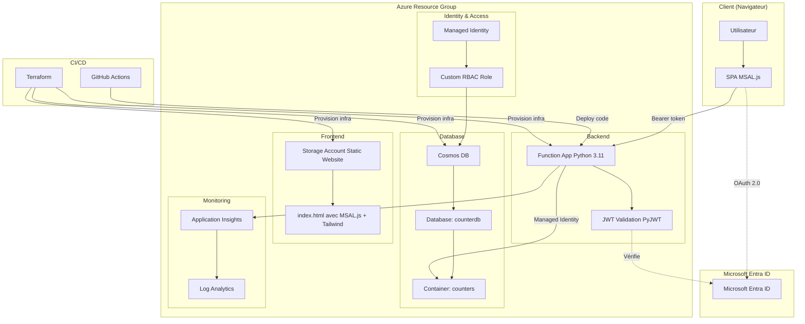
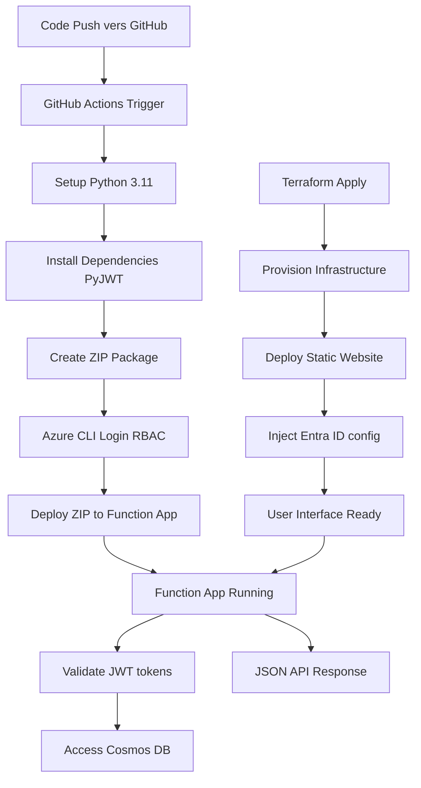
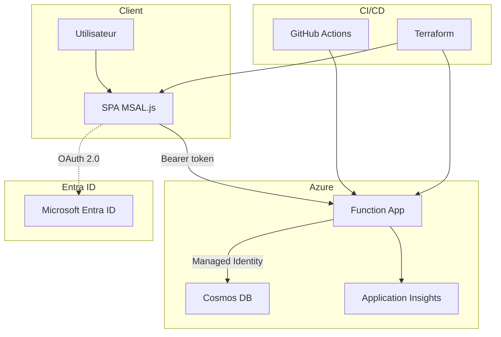

# Azure Functions avec Terraform, MSAL.js et Cosmos DB

Application serverless complète avec authentification OAuth 2.0, déployée sur Azure avec Infrastructure as Code.

## Vue d'ensemble

Compteur interactif sécurisé utilisant :
- **Frontend** : SPA avec MSAL.js + Tailwind CSS
- **Backend** : Azure Functions Python 3.11 avec validation JWT
- **Database** : Cosmos DB avec Managed Identity
- **Auth** : Microsoft Entra ID (OAuth 2.0 / OIDC)
- **Infrastructure** : Terraform
- **CI/CD** : GitHub Actions

## Architecture

### Vue d'ensemble



### Flux de déploiement



### Flux d'authentification détaillé



## Fonctionnalités

✅ Authentification OAuth 2.0 avec MSAL.js  
✅ Validation JWT côté serveur (PyJWT)  
✅ CORS configuré correctement  
✅ Managed Identity pour Cosmos DB (pas de clés)  
✅ Monitoring avec Application Insights  
✅ Infrastructure as Code avec Terraform  
✅ CI/CD automatisé avec GitHub Actions  
✅ Tokens v1.0 supportés  

## Stack technique

| Composant | Technologie | Rôle |
|-----------|-------------|------|
| Frontend | MSAL.js v2 + Tailwind CSS | Auth OAuth 2.0 + UI |
| Backend | Azure Functions Python 3.11 | API serverless |
| Auth | Microsoft Entra ID | Identity Provider |
| Database | Cosmos DB (SQL API) | NoSQL persistence |
| Storage | Azure Storage Static Website | Hébergement SPA |
| Monitoring | Application Insights | Logs et métriques |
| IaC | Terraform | Provisioning infrastructure |
| CI/CD | GitHub Actions | Déploiement automatique |

## Prérequis

- Azure CLI (`az`)
- Terraform (`>= 1.0`)
- Python 3.11
- Compte Azure (Students OK)
- Accès Entra ID pour créer App Registration

## Installation

### 1. Cloner le projet

```bash
git clone <repo-url>
cd AZURE_FUNCTION
```

### 2. Configurer Entra ID

Voir [AUTHENTICATION.md](AUTHENTICATION.md) pour la configuration complète.

**Résumé** :
1. Créer App Registration dans Entra ID
2. Type : **Single-page application (SPA)**
3. Exposer API avec scope `user_impersonation`
4. Accorder admin consent
5. Récupérer `client_id` et `tenant_id`

### 3. Configurer Terraform

```bash
cd terraform
cp terraform.tfvars.example terraform.tfvars
```

Éditer `terraform.tfvars` :

```hcl
# Identifiants Azure
subscription_id = "votre-subscription-id"
tenant_id      = "votre-tenant-id"
entra_client_id = "votre-client-id"

# Configuration projet
resource_group_name     = "vladimirpoutine69"
resource_group_location = "francecentral"

# Noms des ressources (optionnel, valeurs par défaut OK)
sa_name            = "vladimirpoutine69"
sa_staticweb_name  = "vladimirpoutine69"
fa_name            = "vladimirpoutine69"
cosmos_account_name = "vladimirpoutine69"
```

### 4. Créer Service Principal pour GitHub Actions

```bash
az ad sp create-for-rbac \
  --name "sp-github-actions" \
  --skip-assignment \
  --sdk-auth
```

Copier tout le JSON de sortie dans le secret GitHub `AZURE_RBAC_CREDENTIALS`.

Récupérer l'Object ID :

```bash
az ad sp show --id "<client-id-du-sp>" --query id -o tsv
```

Ajouter dans `terraform.tfvars` :

```hcl
github_actions_object_id = "object-id-du-sp"
```

### 5. Déployer l'infrastructure

```bash
terraform init
terraform plan
terraform apply
```

**Durée** : ~5-10 minutes

### 6. Déployer le code

```bash
cd ..
git add .
git commit -m "Initial deployment"
git push origin main
```

GitHub Actions déploie automatiquement la Function App (~3-5 min).

### 7. Tester

```bash
# Récupérer l'URL du site
cd terraform
terraform output primary_web_endpoint

# Ouvrir dans le navigateur
open $(terraform output -raw primary_web_endpoint)
```

Se connecter avec un compte Entra ID et tester le compteur.

## Structure du projet

```
.
├── .github/
│   └── workflows/
│       └── azure-function-app-python.yml  # Pipeline CI/CD
├── terraform/
│   ├── app_function.tf                    # Function App + CORS
│   ├── staticweb_sa.tf                    # Static Website + HTML inject
│   ├── cosmos.tf                          # Cosmos DB + RBAC
│   ├── github.tf                          # RBAC GitHub Actions
│   ├── variables.tf                       # Variables
│   ├── outputs.tf                         # Outputs
│   ├── terraform.tfvars                   # Valeurs (à créer)
│   └── ...
├── website/
│   └── index.html                         # SPA avec MSAL.js
├── function_app.py                        # API avec validation JWT
├── requirements.txt                       # Dépendances Python
├── host.json                              # Config Azure Functions
├── README.md                              # Ce fichier
└── AUTHENTICATION.md                      # Doc détaillée auth
```

## Configuration Terraform

### CORS Function App

```hcl
cors {
  allowed_origins = [
    trimsuffix(azurerm_storage_account.static_website.primary_web_endpoint, "/")
  ]
  support_credentials = false  # Pas de cookies avec Bearer tokens
}
```

**Important** : `trimsuffix()` enlève le `/` final pour éviter les problèmes de CORS.

### Variables d'environnement Function App

```hcl
app_settings = {
  "COSMOS_DB_ENDPOINT"             = azurerm_cosmosdb_account.counter_db.endpoint
  "COSMOS_DB_DATABASE"             = "counterdb"
  "COSMOS_DB_CONTAINER"            = "counters"
  "COSMOS_DB_USE_MANAGED_IDENTITY" = "true"
  
  # Pour validation JWT
  "TENANT_ID"       = var.tenant_id
  "ENTRA_CLIENT_ID" = var.entra_client_id
}
```

### Injection HTML

Terraform remplace automatiquement les placeholders dans `index.html` :

```javascript
// AVANT déploiement
clientId: "COUNTER_CLIENT_ID"
authority: "https://login.microsoftonline.com/COUNTER_TENANT_ID"
const API_URL = 'COUNTER_API_URL/api/counter';

// APRÈS terraform apply
clientId: "f6fe2ea9-9292-482f-9eb7-b60f58c39207"
authority: "https://login.microsoftonline.com/901cb4ca-b862-4029-9306-e5cd0f6d9f86"
const API_URL = 'https://vladimirpoutine69.azurewebsites.net/api/counter';
```

## Validation JWT

### Code Python (function_app.py)

```python
TENANT_ID = os.environ.get('TENANT_ID')
CLIENT_ID = os.environ.get('ENTRA_CLIENT_ID')

# ⚠️ IMPORTANT : Token v1.0 issuer
ISSUER = f"https://sts.windows.net/{TENANT_ID}/"

def validate_token(token: str) -> dict:
    # 1. Récupérer kid du header
    unverified_header = jwt.get_unverified_header(token)
    kid = unverified_header.get('kid')
    
    # 2. Trouver clé publique Microsoft
    jwks = get_jwks()  # Cache des clés
    public_key = jwt.algorithms.RSAAlgorithm.from_jwk(...)
    
    # 3. Valider token
    decoded = jwt.decode(
        token,
        public_key,
        algorithms=['RS256'],
        audience=f"api://{CLIENT_ID}",
        issuer=ISSUER  # Doit matcher token
    )
    
    return decoded
```

### Décorateur de protection

```python
@app.route(route="counter", methods=["GET", "POST"])
@require_auth  # Vérifie le token JWT
def counter(req):
    user_name = req.claims.get('name')
    # Logique métier...
```

## Endpoints API

| Route | Méthode | Auth | Description |
|-------|---------|------|-------------|
| `/api/counter` | OPTIONS | ❌ | CORS preflight |
| `/api/counter` | GET | ✅ | Récupérer valeur |
| `/api/counter` | POST | ✅ | Modifier valeur |

**Actions POST** : `increment`, `decrement`, `reset`

```bash
# Exemple avec curl (nécessite token valide)
curl -X POST https://vladimirpoutine69.azurewebsites.net/api/counter \
  -H "Authorization: Bearer <token>" \
  -H "Content-Type: application/json" \
  -d '{"action": "increment"}'
```

## Cosmos DB

### Accès sécurisé

Utilise **Managed Identity** au lieu de clés :

```hcl
resource "azurerm_cosmosdb_sql_role_assignment" "function_cosmos_access_v2" {
  principal_id       = azurerm_linux_function_app.vladimirpoutine69.identity[0].principal_id
  role_definition_id = azurerm_cosmosdb_sql_role_definition.counter_admin.id
  scope              = azurerm_cosmosdb_account.counter_db.id
}
```

### Structure données

```json
{
  "id": "main-counter",
  "value": 42,
  "created_at": "2025-01-01T00:00:00.000Z",
  "last_updated": "2025-01-01T12:30:00.000Z",
  "last_user": "dylan.weinachter@epitech.eu"
}
```

## Monitoring

### Application Insights

```bash
# Voir les logs de validation JWT
az monitor app-insights query \
  --app vladimirpoutine69 \
  --analytics-query "traces | where message contains 'Token validé' | take 10"
```

### Logs en temps réel

```bash
az functionapp log tail \
  --name vladimirpoutine69 \
  --resource-group rg-vladimirpoutine69
```

## Troubleshooting

### Erreur CORS

**Symptôme** : `No 'Access-Control-Allow-Origin' header`

**Solution** : Vérifier le CORS Terraform avec `trimsuffix()`

```bash
# Tester preflight
curl -i -X OPTIONS \
  -H "Origin: https://staticvladimirpoutine69.z28.web.core.windows.net" \
  https://vladimirpoutine69.azurewebsites.net/api/counter
```

### Erreur JWT : Issuer invalide

**Symptôme** : `Token invalide: Issuer invalide`

**Cause** : Token v1.0 vs v2.0

**Solution** : Vérifier l'issuer du token

```javascript
// Console navigateur
const token = await getAccessToken();
const payload = JSON.parse(atob(token.split('.')[1]));
console.log(payload.iss);

// Si sts.windows.net → token v1.0 (notre cas)
// Si login.microsoftonline.com/v2.0 → token v2.0
```

Ajuster `function_app.py` :

```python
# Pour token v1.0
ISSUER = f"https://sts.windows.net/{TENANT_ID}/"
```

### Placeholders non remplacés

**Symptôme** : Page affiche `COUNTER_CLIENT_ID`

**Solution** : Redéployer HTML avec Terraform

```bash
cd terraform
terraform apply -auto-approve
```

Voir [AUTHENTICATION.md](AUTHENTICATION.md) pour plus de troubleshooting.

## Coûts estimés

| Ressource | Coût/mois | Notes |
|-----------|-----------|-------|
| Function App Y1 | Gratuit | 1M exécutions/mois gratuites |
| Storage Accounts | ~0.04€ | 2 comptes (Function + Static) |
| Cosmos DB | ~24€ | 400 RU/s provisionnées |
| Application Insights | Gratuit | < 5GB/mois |
| Entra ID | Gratuit | Inclus Azure |
| **Total** | **~24€** | Usage faible/moyen |

**Optimisations** :
- Cosmos DB auto-scaling
- Lifecycle policies pour logs
- Monitoring des coûts

## Sécurité

### Bonnes pratiques appliquées

✅ Pas de secrets côté client (SPA = public client)  
✅ Validation JWT complète (signature, exp, aud, iss)  
✅ Managed Identity pour Cosmos DB  
✅ CORS restrictif (origine exacte)  
✅ HTTPS uniquement  
✅ Logs de sécurité dans Application Insights  
✅ Principe du moindre privilège (RBAC Cosmos DB)  

### Checklist déploiement production

- [ ] Admin consent accordé dans Entra ID
- [ ] CORS avec origine exacte (pas `*`)
- [ ] `@require_auth` sur toutes routes sensibles
- [ ] Monitoring activé
- [ ] Alertes configurées
- [ ] Secrets GitHub configurés
- [ ] Managed Identity pour toutes ressources
- [ ] Backup Cosmos DB configuré

## Développement local

### Prérequis

- Azure Functions Core Tools
- Python 3.11
- Azurite (émulateur Storage)

### Lancer localement

```bash
# Installer dépendances
pip install -r requirements.txt

# Configurer local.settings.json
cp local.settings.json.example local.settings.json
# Éditer avec tes valeurs

# Démarrer
func start
```

**Note** : Auth Entra ID fonctionne en local si redirect URI configuré pour `http://localhost:7071`.

## CI/CD

GitHub Actions déploie automatiquement sur push vers `main` :

1. Setup Python 3.11
2. Install dependencies (PyJWT, requests, etc.)
3. Create ZIP package
4. Deploy to Function App via Azure CLI
5. Remote build sur Azure

**Durée** : 3-5 minutes

## Comparaison AWS

| Composant | Azure | AWS |
|-----------|-------|-----|
| Serverless | Azure Functions | Lambda + API Gateway |
| Auth | Entra ID + MSAL.js | Cognito + Amplify |
| NoSQL | Cosmos DB | DynamoDB |
| Static Web | Storage Static Website | S3 Static Website |
| IaC | Terraform (azurerm) | Terraform (aws) / CloudFormation |
| Monitoring | Application Insights | CloudWatch |

## Ressources

- [Documentation Azure Functions](https://learn.microsoft.com/azure/azure-functions/)
- [MSAL.js Documentation](https://github.com/AzureAD/microsoft-authentication-library-for-js)
- [Terraform azurerm Provider](https://registry.terraform.io/providers/hashicorp/azurerm/latest/docs)
- [AUTH.md](AUTHENTICATION.md) - Guide détaillé OAuth 2.0
