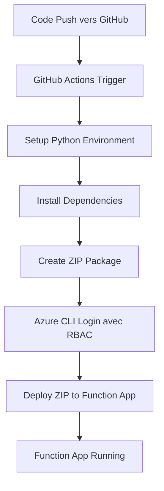

# Documentation: Azure Functions avec Terraform et GitHub Actions

## Table des matières

- [Vue d'ensemble](#vue-densemble)
- [Architecture du projet](#architecture-du-projet)
- [Infrastructure Terraform](#infrastructure-terraform)
- [GitHub Actions CI/CD](#github-actions-cicd)
- [Déploiement et sécurité](#déploiement-et-sécurité)
- [Troubleshooting](#troubleshooting)
- [Bonnes pratiques](#bonnes-pratiques)

## Vue d'ensemble

Ce projet déploie une Azure Function App en utilisant l'Infrastructure as Code (Terraform) et un pipeline de déploiement automatisé (GitHub Actions). L'architecture utilise le plan **Flex Consumption (FC1)**, optimisé pour les charges de travail serverless avec une facturation à l'usage.

### Technologies utilisées

- **Azure Functions** : Plateforme serverless pour exécuter du code event-driven
- **Terraform** : Infrastructure as Code pour provisionner les ressources Azure
- **GitHub Actions** : CI/CD pour automatiser le déploiement
- **Python 3.13** : Runtime de la fonction
- **Azure RBAC** : Authentification sécurisée pour le déploiement

## Architecture du projet

### Structure des fichiers

```
AZURE_FUNCTION/
├── .github/
│   └── workflows/
│       └── deploy.yml              # Pipeline GitHub Actions
├── terraform/
│   ├── main.tf                     # Ressources principales
│   ├── variables.tf                # Variables Terraform
│   ├── outputs.tf                  # Outputs Terraform
│   └── terraform.tfvars            # Valeurs des variables
├── function_app.py                 # Code de la fonction principale
├── host.json                       # Configuration Azure Functions
├── requirements.txt                # Dépendances Python
├── local.settings.json             # Configuration locale (dev)
└── README.md                       # Documentation
```

### Flux de déploiement



## Infrastructure Terraform

### Ressources créées

#### 1. Resource Group
```hcl
resource "azurerm_resource_group" "example" {
  location = var.resource_group_location
  name     = coalesce("${var.resource_group_name_prefix}-${var.resource_group_name}", random_pet.rg_name.id)
}
```

**Rôle** : Conteneur logique pour toutes les ressources du projet

#### 2. Storage Account
```hcl
resource "azurerm_storage_account" "example" {
  name                     = coalesce(var.sa_name, random_string.name.result)
  resource_group_name      = azurerm_resource_group.example.name
  location                 = azurerm_resource_group.example.location
  account_tier             = var.sa_account_tier
  account_replication_type = var.sa_account_replication_type
}
```

**Rôle** : 
- Stockage du code de la fonction (deployment packages)
- Stockage des logs et métadonnées
- Support pour Table Storage (si utilisé par la fonction)

**Configuration** :
- Tier : Standard (par défaut)
- Réplication : LRS (Local Redundant Storage)
- Accès public activé pour les déploiements

#### 3. Storage Container
```hcl
resource "azurerm_storage_container" "example" {
  name                  = "example-flexcontainer"
  storage_account_id    = azurerm_storage_account.example.id
  container_access_type = "private"
}
```

**Rôle** : Container blob privé pour stocker les packages de déploiement

#### 4. Log Analytics Workspace
```hcl
resource "azurerm_log_analytics_workspace" "example" {
  name                = coalesce(var.ws_name, random_string.name.result)
  location            = azurerm_resource_group.example.location
  resource_group_name = azurerm_resource_group.example.name
  sku                 = "PerGB2018"
  retention_in_days   = 30
}
```

**Rôle** : Collecte et analyse des logs pour Application Insights

#### 5. Application Insights
```hcl
resource "azurerm_application_insights" "example" {
  name                = coalesce(var.ai_name, random_string.name.result)
  location            = azurerm_resource_group.example.location
  resource_group_name = azurerm_resource_group.example.name
  application_type    = "web"
  workspace_id        = azurerm_log_analytics_workspace.example.id
}
```

**Rôle** : 
- Monitoring des performances
- Collecte des logs applicatifs
- Debugging et diagnostics

#### 6. Service Plan (Flex Consumption)
```hcl
resource "azurerm_service_plan" "example" {
  name                = coalesce(var.asp_name, random_string.name.result)
  resource_group_name = azurerm_resource_group.example.name
  location            = azurerm_resource_group.example.location
  sku_name            = "FC1"
  os_type             = "Linux"
}
```

**Caractéristiques FC1** :
- **Facturation** : Pay-per-execution + temps d'exécution
- **Scaling** : 0 à N instances automatiquement
- **Démarrage à froid** : Optimisé vs plans traditionnels
- **Limitations** : Pas de build remote classique
- **OS** : Linux uniquement

#### 7. Function App
```hcl
resource "azurerm_function_app_flex_consumption" "example" {
  name                = coalesce(var.fa_name, random_string.name.result)
  resource_group_name = azurerm_resource_group.example.name
  location            = azurerm_resource_group.example.location
  service_plan_id     = azurerm_service_plan.example.id

  storage_container_type      = "blobContainer"
  storage_container_endpoint  = "${azurerm_storage_account.example.primary_blob_endpoint}${azurerm_storage_container.example.name}"
  storage_authentication_type = "StorageAccountConnectionString"
  storage_access_key          = azurerm_storage_account.example.primary_access_key
  runtime_name                = var.runtime_name
  runtime_version             = var.runtime_version
  maximum_instance_count      = 50
  instance_memory_in_mb       = 2048
  
  site_config {
    application_insights_connection_string = azurerm_application_insights.example.connection_string
    application_insights_key              = azurerm_application_insights.example.instrumentation_key
  }

  app_settings = {
    "APPLICATIONINSIGHTS_CONNECTION_STRING" = azurerm_application_insights.example.connection_string
    "APPINSIGHTS_INSTRUMENTATIONKEY"       = azurerm_application_insights.example.instrumentation_key
    "AzureWebJobsStorage"                  = azurerm_storage_account.example.primary_connection_string
  }
}
```

**Configuration** :
- **Runtime** : Python 3.13
- **Mémoire max** : 2048 MB par instance
- **Instances max** : 50 (ajustable)
- **Storage** : Connection string authentication

### Système de permissions RBAC

#### Problématique des comptes Azure Students
Les comptes Azure Students ont des restrictions sur la création d'applications Azure AD. Solution adoptée :

1. **Création manuelle** du service principal
2. **Assignment automatique** des rôles via Terraform

#### Commandes manuelles requises

##### Création du Service Principal
```bash
# Créer le service principal pour GitHub Actions
az ad sp create-for-rbac \
  --name "sp-github-actions" \
  --skip-assignment \
  --sdk-auth
```

**Output à sauvegarder** : JSON complet pour le secret GitHub `AZURE_RBAC_CREDENTIALS`

##### Récupération de l'Object ID
```bash
# Récupérer l'Object ID avec le Client ID obtenu précédemment
az ad sp show --id "VOTRE-CLIENT-ID" --query id -o tsv
```

**Utilisation** : Passer cette valeur à Terraform via un .tfvars

#### Rôles assignés
```hcl
resource "azurerm_role_assignment" "github_actions_website" {
  scope                = azurerm_resource_group.example.id
  role_definition_name = "Website Contributor"
  principal_id         = var.github_actions_object_id
}

resource "azurerm_role_assignment" "github_actions_storage" {
  scope                = azurerm_storage_account.example.id
  role_definition_name = "Storage Blob Data Contributor"
  principal_id         = var.github_actions_object_id
}
```

**Website Contributor** :
- Déploiement d'applications web
- Gestion des app settings
- Redémarrage des services

**Storage Blob Data Contributor** :
- Upload des packages de déploiement
- Accès aux containers blob

## GitHub Actions CI/CD

### Configuration du workflow

#### Trigger
```yaml
on:
  push:
    branches: ["main" ,"je_lis_la_doc_zzzz"]
```

Le pipeline se déclenche sur chaque push vers les branches `main` et `je_lis_la_doc_zzzz`.

#### Variables d'environnement
```yaml
env:
  AZURE_FUNCTIONAPP_NAME: 'vladimirpoutine69'
  AZURE_FUNCTIONAPP_PACKAGE_PATH: '.'
  PYTHON_VERSION: '3.13'
```

### Étapes du pipeline

#### 1. Checkout du code
```yaml
- name: 'Checkout GitHub Action'
  uses: actions/checkout@v4
```

Récupère le code source depuis le repository.

#### 2. Authentification Azure
```yaml
- name: 'Login via Azure CLI'
  uses: azure/login@v2
  with:
    creds: ${{ secrets.AZURE_RBAC_CREDENTIALS }}
```

**Secret AZURE_RBAC_CREDENTIALS** format :
```json
{
  "clientId": "12345678-1234-...",
  "clientSecret": "secret-value",
  "subscriptionId": "87654321-4321-...",
  "tenantId": "tenant-id-..."
}
```

#### 3. Setup environnement Python
```yaml
- name: Setup Python ${{ env.PYTHON_VERSION }} Environment
  uses: actions/setup-python@v4
  with:
    python-version: ${{ env.PYTHON_VERSION }}
```

#### 4. Installation des dépendances
```yaml
- name: 'Resolve Project Dependencies Using Pip'
  shell: bash
  run: |
    pushd './${{ env.AZURE_FUNCTIONAPP_PACKAGE_PATH }}'
    python -m pip install --upgrade pip
    pip install -r requirements.txt --target=".python_packages/lib/site-packages"
    popd
```

**Important** : Les dépendances sont installées dans `.python_packages/lib/site-packages/` pour être compatibles avec Azure Functions.

#### 5. Création du package de déploiement
```yaml
- name: 'Create deployment package'
  shell: bash
  run: |
    echo "Creating deployment package..."
    zip -r function-app.zip . \
      -x "*.git*" "__pycache__/*" "*.pyc" "venv/*" ".env*" "local.settings.json" ".github/*"
```

**Fichiers exclus** :
- `.git*` : Historique Git
- `__pycache__/*` : Cache Python
- `venv/*` : Environnement virtuel local
- `.env*` : Variables d'environnement sensibles
- `.github/*` : Workflows (inutiles dans la fonction)

#### 6. Déploiement
```yaml
- name: 'Deploy to Azure Functions'
  shell: bash
  run: |
    RG_NAME=$(az resource list --name ${{ env.AZURE_FUNCTIONAPP_NAME }} --resource-type "Microsoft.Web/sites" --query "[0].resourceGroup" -o tsv)
    
    az functionapp deployment source config-zip \
      --resource-group $RG_NAME \
      --name ${{ env.AZURE_FUNCTIONAPP_NAME }} \
      --src function-app.zip
```

**Méthode** : ZIP deployment via Azure CLI

## Déploiement et sécurité

### Processus d'authentification RBAC

#### 1. Création du service principal
```bash
az ad sp create-for-rbac \
  --name "sp-github-actions" \
  --skip-assignment \
  --sdk-auth
```

#### 2. Assignment des rôles via Terraform
- Les permissions sont assignées au niveau Resource Group et Storage Account
- Principe du moindre privilège appliqué

#### 3. Utilisation dans GitHub Actions
- Le service principal s'authentifie avec `clientId` + `clientSecret`
- Azure CLI utilise ces credentials automatiquement

### Sécurité des secrets

#### GitHub Secrets utilisés :
- `AZURE_RBAC_CREDENTIALS` : Credentials complets du service principal

#### App Settings sensibles :
- `AzureWebJobsStorage` : Connection string du storage account
- `APPLICATIONINSIGHTS_CONNECTION_STRING` : Télémétrie

### Spécificités Flex Consumption

#### Limitations
- **Pas de build remote classique** : `SCM_DO_BUILD_DURING_DEPLOYMENT` non supporté
- **ZIP deployment uniquement** : Pas de déploiement depuis Git
- **Dépendances pré-installées** : Incluses dans le package ZIP

#### Avantages
- **Cold start optimisé** : Démarrage plus rapide
- **Scaling intelligent** : Auto-scaling basé sur la demande
- **Coût optimisé** : Pay-per-execution précis

## Troubleshooting

### Erreurs communes

#### 1. Erreur 403 lors de création service principal
```
Error: Authorization_RequestDenied: Insufficient privileges
```

**Cause** : Compte Azure Students - permissions limitées  
**Solution** : Création manuelle du service principal

#### 2. App settings non supportés
```
InvalidAppSettingsException: SCM_DO_BUILD_DURING_DEPLOYMENT not supported
```

**Cause** : FC1 ne supporte pas les settings de build classiques  
**Solution** : Supprimer ces app settings

#### 3. Fonction erreur 500
```
'NoneType' object has no attribute 'lower'
```

**Cause** : `AzureWebJobsStorage` non défini  
**Solution** : Configurer la connection string du storage

#### 4. Dépendances non trouvées
```
ModuleNotFoundError: No module named 'azure.data.tables'
```

**Cause** : Dépendances non incluses dans le package  
**Solution** : Installer dans `.python_packages/lib/site-packages/`

## Bonnes pratiques

### Infrastructure

#### Naming conventions
- **Resource Group** : `rg-{project}-{env}`
- **Function App** : `func-{project}-{env}`
- **Storage Account** : `st{project}{env}{random}`

#### Environments séparés
- **Dev** : Pour le développement et tests
- **Staging** : Validation pré-production
- **Production** : Environnement live

### Sécurité

#### Rotation des secrets
- **Service principal** : Renouveler les secrets annuellement
- **Storage keys** : Utiliser managed identities quand possible

#### Monitoring
- **Application Insights** : Toujours activé
- **Alerts** : Configurer sur les erreurs et latence
- **Log retention** : Définir selon les besoins de compliance

### Développement

#### Structure du code
```python
import azure.functions as func
import logging

app = func.FunctionApp(http_auth_level=func.AuthLevel.FUNCTION)

@app.route(route="hello", methods=["GET", "POST"])
def hello_world(req: func.HttpRequest) -> func.HttpResponse:
    logging.info('Function processed a request')
    return func.HttpResponse("Hello World!")
```

#### Tests locaux
```bash
# Installer Azure Functions Core Tools
func start

# Tester la fonction
curl http://localhost:7071/api/hello
```

### Déploiement

#### Validation avant merge
- Tests unitaires automatisés
- Validation du package ZIP
- Vérification des secrets

#### Rollback strategy
- Conserver les packages précédents
- Monitorer les métriques post-déploiement
- Plan de rollback documenté

## Conclusion

Cette architecture offre :

- **Scalabilité** : Auto-scaling serverless
- **Sécurité** : RBAC et secrets management
- **Automatisation** : CI/CD complet
- **Monitoring** : Logs et métriques centralisés
- **Coût** : Optimisé pay-per-execution

Le projet est prêt pour évoluer vers des cas d'usage plus complexes tout en maintenant les bonnes pratiques DevOps et sécurité.